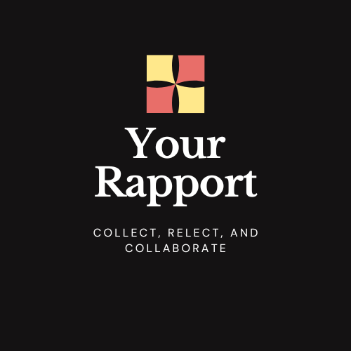

# Your Rapport – Collect, Reflect, and Collaborate.

Your Rapport is an open source "Chrome Extension" digital archiving and intelligence tool that collects online conversations using intelligent screenshot automation 
and makes the content fully searchable for professionals, amateurs, and archivists who need to preserve, analyze, or audit digital 
dialogue across platforms, Your Rapport bridges visual capture with text-based search, turning ephemeral interactions 
into permanent, searchable records. Your Rapport is an Open Source tool that implements the best practices for 
protecting your privacy and documenting online content. You can easily import, export, or print screenshots from 
your collection. Your Rapport is free to use, but has a couple pro features you will need to pay for, eventually. 
This enables us to continue development and support for this product. 

Please consider supporting this project with a [pro license](https://buy.stripe.com/4gM5kDbRcgWW8d7gLedAk00).

Check out the wiki for more in depth information. 

### Getting Started 
After installing the Chrome extension from https://chromewebstore.google.com/detail/your-rapport/clkaalonjdkliiaadkgodlfbiipidjmn, 
"Your Rapport" will automatically be ready to collect.

There are several options for collecting a screenshot of a web page:
 * `Mouse - Right Click` and select the **Autoscroll Collect** menu option with the "Your Rapport" logo
 * `Alt+S` collects a single screenshot and deep copy which is an mhtml file
 * `Alt+A` autoscroll and collect multiple screenshots, or stop the autoscroll.
 * `Alt+X` opens up the dashboard where you can search, print, share, or delete your collection. 
 * `Alt+Q` quick scan the web page for selectors and show the counts on the extension pin. 
 * Click the "Your Rapport" pin in your extension tab and select the action you want performed.  

Your Rapport is an open source commercial tool for the following reasons:
 * Transparency in how software works and where the data goes is an important security and privacy concern to all of us
 * A commercial tool is the only viable way to support developing a standard set of open source tools, useful for doing online research
 * Keeps the infrastructure costs lower by not having additional overhead with privatized Software as a Service approach
 * Implement best practices based on community feedback
 * The target price for the Pro license can be set to $3 a month support us [here](https://buy.stripe.com/4gM5kDbRcgWW8d7gLedAk00) 

🌟 Key Features

📸 Smart Screenshot Capture
Automatically takes screenshots of chats, posts, comments, and threads across the web.

🤖 Automated Bulk Screenshot Captures
Your Rapport lets you provide a list of URLs to scrape. This saves you time by being able to scrape large amounts of
data, while you work on other tasks. You can also right click on a link to add the URL to the automation queue for 
future scraping.

🔍 Searchable Text Extraction
Uses advanced algorithms to extract text from screenshots, making every captured conversation searchable by keyword, 
username, or phrase.

📗 Quick Scan 
Shows how many of your keyword selectors are contained on the web page within the Extension Pin. Making it
easy to determine if the current page has any pertinent information

📚 Discovery Plugins
Are small json scripts that allow you to link your selectors to specific websites for enrichment. Example, if you find a 
phone number and have installed the Discovery Plugin from the Package Management screen, you will now be able to streamline
searching against several of the data brokers. 

🌱 Companion Extensions
Are chrome extensions that will provide improvements to your workflow. For example, "[Who Am I](https://chromewebstore.google.com/detail/who-am-i/gdnhlhadhgnhaenfcphpeakdghkccfoo)"
 a Chrome extension, provides username enumeration across a couple thousand websites. Who Am I has a button in its
UI that will trigger the "Your Rapport" extension to scrape the selected social website with the click of a button. 

💬 Platform-Agnostic
Works across social media platforms, messaging apps (via web interfaces), forums, and more.

🔐 Private & Secure
Your captured content stays on your machine utilizing your browser's security and privacy protections.

🔗 Share Your Rapport Collection 
The data exported from Your Rapport is in a Non-Proprietary format known as JSON.
Your collection can be downloaded as "json" file(s) which lets you easily share them with
others using email or other file sharing apps. The screenshots can be individually downloaded, too. 

🖨️ Printable Report(s)
There is a lightweight print function that lets you download a PDF with the screenshot and metadata.

🧠 Best Data Integrity Practices, so far:
* Signed Hash for verifying each screenshot's integrity
* Multiple timestamps are collected
* Multiple attributes about the computer that took the screenshot are captured
* Source code is Open Source

